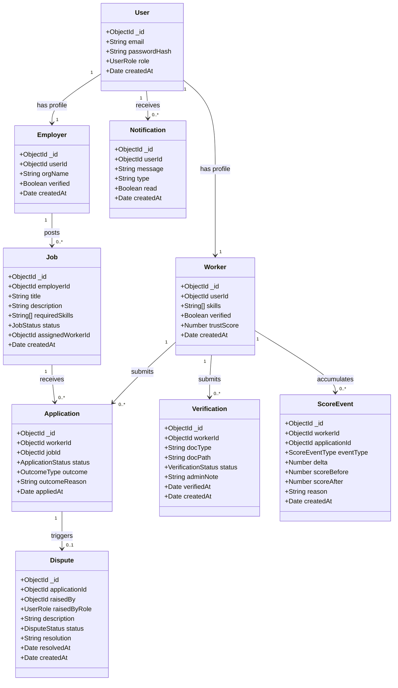
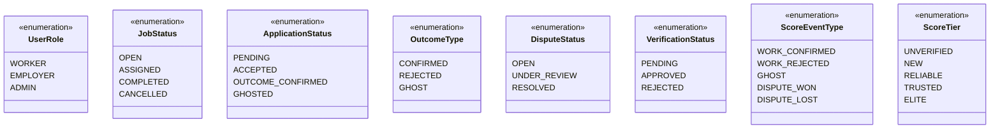
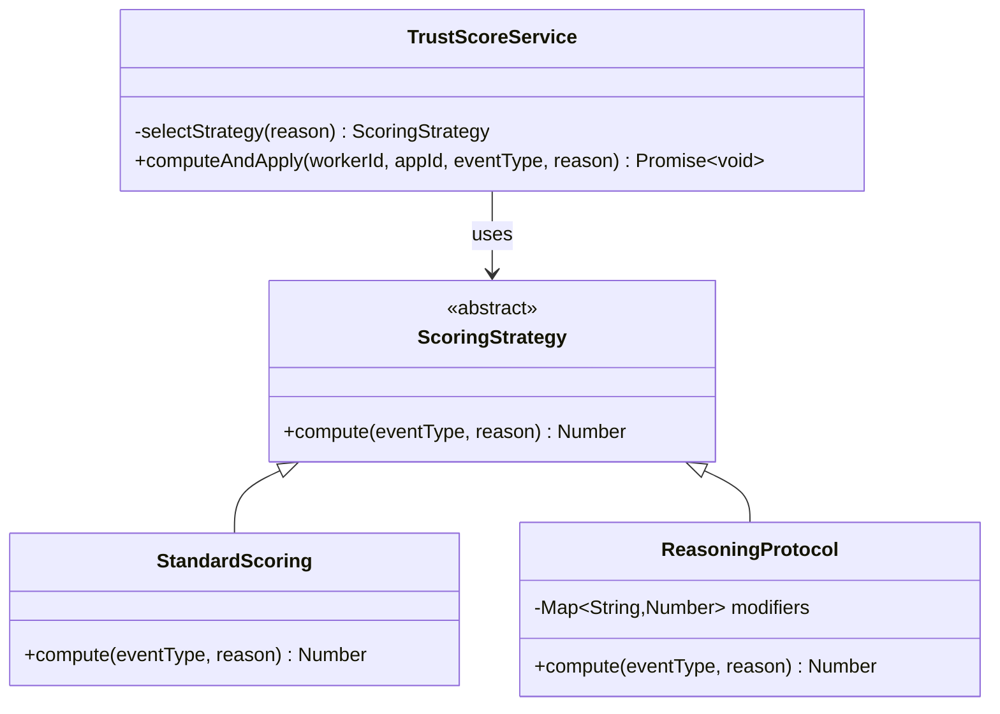
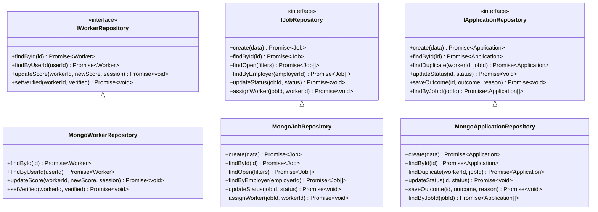
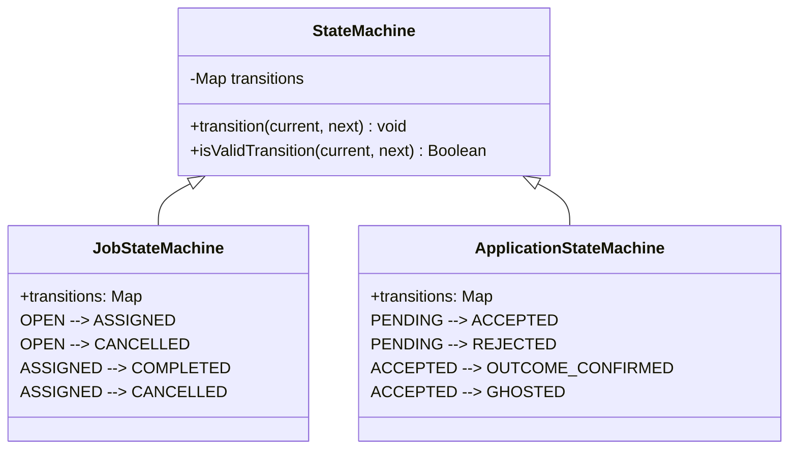
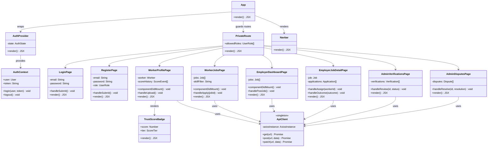

# Class Diagram — Credwork

## Domain / Model Layer

---

## Enum Definitions

---

## Service Layer

```mermaid
classDiagram

    class AuthService {
        -IUserRepository userRepo
        -IWorkerRepository workerRepo
        -IEmployerRepository employerRepo
        +register(email, password, role) Promise~AuthResult~
        +login(email, password) Promise~AuthResult~
        +generateJWT(userId, role) String
        +verifyJWT(token) JWTPayload
    }

    class JobService {
        -IJobRepository jobRepo
        +postJob(employerId, data) Promise~Job~
        +listOpenJobs(filters) Promise~Job[]~
        +getJobById(jobId) Promise~Job~
        +getEmployerJobs(employerId) Promise~Job[]~
        +assignWorker(jobId, workerId) Promise~Job~
        +submitOutcome(jobId, outcome, reason) Promise~void~
        +getJobApplications(jobId) Promise~Application[]~
    }

    class ApplicationService {
        -IApplicationRepository appRepo
        +applyForJob(workerId, jobId) Promise~Application~
        +getApplicationById(appId) Promise~Application~
        +saveOutcome(appId, outcome, reason) Promise~void~
    }

    class TrustScoreService {
        -IWorkerRepository workerRepo
        -IScoreEventRepository scoreEventRepo
        -EventBus eventBus
        +computeAndApply(workerId, appId, eventType, reason) Promise~void~
        -selectStrategy(reason) ScoringStrategy
        -clamp(value) Number
    }

    class DisputeService {
        -IDisputeRepository disputeRepo
        -EventBus eventBus
        +raiseDispute(appId, raisedBy, role, description) Promise~Dispute~
        +getAllDisputes() Promise~Dispute[]~
        +resolveDispute(disputeId, resolution) Promise~Dispute~
    }

    class WorkerService {
        -IWorkerRepository workerRepo
        +createWorkerProfile(userId) Promise~Worker~
        +getWorkerProfile(workerId) Promise~Worker~
        +getWorkerScore(workerId) Promise~ScoreData~
        +findByUserId(userId) Promise~Worker~
    }

    class EmployerService {
        -IEmployerRepository employerRepo
        +createEmployerProfile(userId) Promise~Employer~
        +getEmployerProfile(employerId) Promise~Employer~
    }

    class VerificationService {
        -IVerificationRepository verificationRepo
        -IWorkerRepository workerRepo
        +submitVerification(workerId, docType, docPath) Promise~Verification~
        +getPendingVerifications() Promise~Verification[]~
        +reviewVerification(id, status, note) Promise~Verification~
    }

    class NotificationService {
        -INotificationRepository notificationRepo
        -EventBus eventBus
        +createNotification(userId, message, type) Promise~Notification~
    }

    class EventBus {
        <<singleton>>
        -EventEmitter emitter
        +emit(event, payload) void
        +on(event, handler) void
    }

    AuthService --> WorkerService : creates profile
    AuthService --> EmployerService : creates profile
    ApplicationService --> EventBus : emit outcome.confirmed
    DisputeService --> EventBus : emit dispute.resolved
    TrustScoreService --> EventBus : listens
    NotificationService --> EventBus : listens
```

---

## Scoring Strategy Pattern

---

## Repository Pattern

---

## State Machine

---

## Frontend Components

