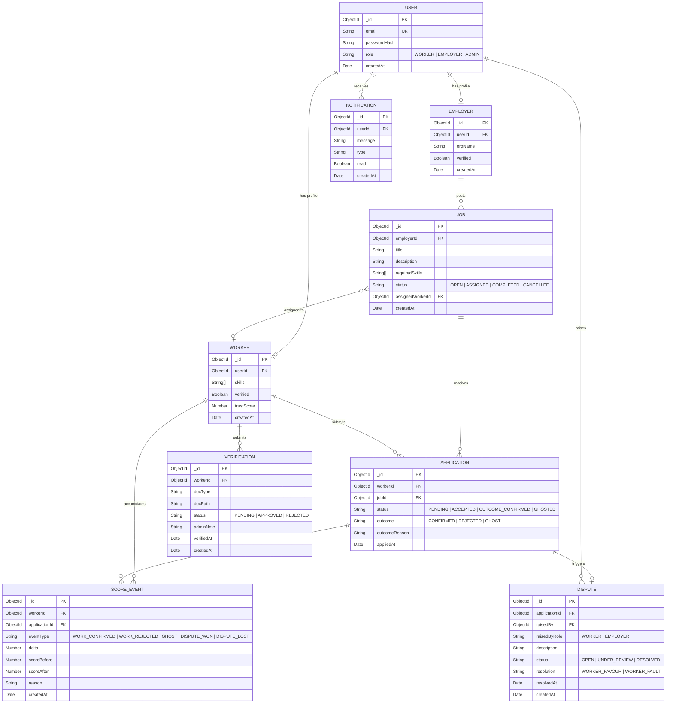

# Entity-Relationship Diagram — Credwork

## Full ER Diagram

---

## Relationship Notes

| Relationship | Cardinality | Notes |
|---|---|---|
| USER → WORKER | 1:0..1 | Only if role = WORKER; auto-created on register |
| USER → EMPLOYER | 1:0..1 | Only if role = EMPLOYER; auto-created on register |
| EMPLOYER → JOB | 1:many | Employer can post multiple jobs |
| JOB → APPLICATION | 1:many | One job receives many applications |
| WORKER → APPLICATION | 1:many | Worker applies to many jobs; unique per (workerId, jobId) |
| APPLICATION → DISPUTE | 1:0..1 | At most one dispute per application |
| USER → DISPUTE | 1:many | Either WORKER or EMPLOYER can raise disputes |
| WORKER → SCORE_EVENT | 1:many | Full audit trail of all score changes |
| APPLICATION → SCORE_EVENT | 1:many | Score events reference the triggering application |
| WORKER → VERIFICATION | 1:many | Worker can submit multiple verification attempts |
| USER → NOTIFICATION | 1:many | System notifications for outcomes and dispute results |
| JOB → WORKER (assignedWorkerId) | many:0..1 | A job can be assigned to at most one worker |

---

## Index Summary

| Collection | Field(s) | Index Type | Purpose |
|---|---|---|---|
| users | email | Unique | Fast login lookup, prevent duplicates |
| workers | userId | Unique | One worker profile per user |
| employers | userId | Unique | One employer profile per user |
| jobs | status | Single | Fast filtering of OPEN jobs |
| jobs | requiredSkills | Multikey | Skill-based job search |
| applications | (workerId, jobId) | Compound Unique | Prevent duplicate applications |
| scoreevents | workerId | Single | Fast score history lookup |
| disputes | status | Single | Filter open/pending disputes |
| notifications | userId | Single | Fast notification retrieval |

---

## Score Event Delta Reference

| eventType | delta | Trigger |
|---|---|---|
| WORK_CONFIRMED | +5 | Employer confirms satisfactory work |
| WORK_REJECTED | −3 | Employer marks work as rejected |
| GHOST | −8 | Worker marked as no-show |
| DISPUTE_WON | +4 | Admin rules in worker's favour |
| DISPUTE_LOST | −6 | Admin rules against worker |

Score is clamped to [0, 100]. Starting score is 50. Updates are atomic (MongoDB session).
