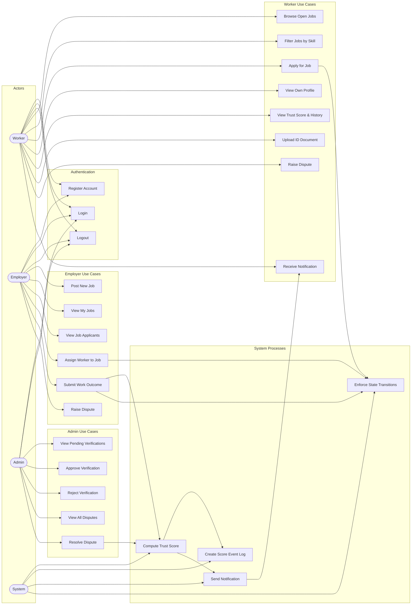

# Use Case Diagram — Credwork

## System Actors

| Actor | Description |
|-------|-------------|
| **Worker** | A gig/informal-sector worker looking for jobs and building a trust reputation |
| **Employer** | An organisation or individual posting jobs and evaluating work outcomes |
| **Admin** | A platform moderator responsible for verification and dispute resolution |
| **System** | Automated system processes (score engine, event bus, notifications) |

---

## Use Case Diagram



---

## Use Cases by Actor

### Worker

| ID | Use Case | Description | Pre-condition | Post-condition |
|----|----------|-------------|---------------|----------------|
| UC1 | Register Account | Worker registers with email, password, and role=WORKER | No existing account | Worker + Worker profile created; score = 50 |
| UC2 | Login | Authenticate with email and password | Account exists | JWT token issued; redirected to dashboard |
| UC3 | Logout | Clear session and token | Logged in | Token removed; redirected to login |
| UC4 | Browse Open Jobs | View all jobs with status=OPEN | Logged in as WORKER | List of available jobs displayed |
| UC5 | Filter Jobs by Skill | Filter job list by required skills | UC4 | Narrowed job list displayed |
| UC6 | Apply for Job | Submit application for a specific OPEN job | Job is OPEN; no prior application | Application created (status=PENDING) |
| UC7 | View Own Profile | View worker profile information | Logged in as WORKER | Profile details displayed |
| UC8 | View Trust Score & History | View current trust score, tier, and full score event audit trail | Logged in as WORKER | Score + ScoreEvent list displayed |
| UC9 | Upload ID Document | Upload an identity document for admin verification | Logged in as WORKER | Verification record created (status=PENDING) |
| UC10 | Raise Dispute | Contest a negative work outcome | Application has outcome recorded | Dispute created (status=OPEN) |
| UC11 | Receive Notification | Receive in-app message on outcome or dispute resolution | System emits event | Notification stored; displayed in UI |

---

### Employer

| ID | Use Case | Description | Pre-condition | Post-condition |
|----|----------|-------------|---------------|----------------|
| UC1 | Register Account | Employer registers with email, password, and role=EMPLOYER | No existing account | User + Employer profile created |
| UC2 | Login | Authenticate with email and password | Account exists | JWT issued; redirected to dashboard |
| UC3 | Logout | Clear session | Logged in | Token removed |
| UC12 | Post New Job | Create a new job listing | Logged in as EMPLOYER | Job created (status=OPEN) |
| UC13 | View My Jobs | View all jobs posted by this employer | Logged in as EMPLOYER | Job list displayed |
| UC14 | View Job Applicants | View list of workers who applied to a specific job | Job exists and belongs to employer | Applicant list displayed |
| UC15 | Assign Worker to Job | Select one applicant and assign them to the job | Job=OPEN; Application=PENDING | Job→ASSIGNED; Application→ACCEPTED |
| UC16 | Submit Work Outcome | Record outcome as CONFIRMED, REJECTED, or GHOST | Job=ASSIGNED | Application→OUTCOME_CONFIRMED or GHOSTED; score event triggered |
| UC17 | Raise Dispute | Contest a worker's claim | Application has outcome | Dispute created (status=OPEN) |

---

### Admin

| ID | Use Case | Description | Pre-condition | Post-condition |
|----|----------|-------------|---------------|----------------|
| UC2 | Login | Authenticate as ADMIN | ADMIN account exists | JWT issued; redirected to admin panel |
| UC18 | View Pending Verifications | View list of all verification documents awaiting review | Logged in as ADMIN | Verification list displayed |
| UC19 | Approve Verification | Mark verification as APPROVED | Verification=PENDING | Verification→APPROVED; Worker.verified=true |
| UC20 | Reject Verification | Mark verification as REJECTED with a note | Verification=PENDING | Verification→REJECTED; Worker.verified=false |
| UC21 | View All Disputes | View all open and resolved disputes | Logged in as ADMIN | Dispute list displayed |
| UC22 | Resolve Dispute | Choose WORKER_FAVOUR or WORKER_FAULT | Dispute=OPEN | Dispute→RESOLVED; score delta applied |

---

### System (Automated)

| ID | Use Case | Description | Trigger |
|----|----------|-------------|---------|
| UC23 | Compute Trust Score | Select scoring strategy and calculate delta | outcome.confirmed or dispute.resolved event |
| UC24 | Create Score Event Log | Atomically record ScoreEvent + update Worker.trustScore | UC23 |
| UC25 | Send Notification | Create a Notification document for the relevant user | UC23 complete |
| UC26 | Enforce State Transitions | StateMachine validates and rejects invalid status changes | Application submit, assign, or outcome actions |

---

## Include / Extend Relationships

```
UC16 (Submit Work Outcome)
  <<includes>> UC23 (Compute Trust Score)
  <<includes>> UC26 (Enforce State Transitions)

UC22 (Resolve Dispute)
  <<includes>> UC23 (Compute Trust Score)

UC23 (Compute Trust Score)
  <<includes>> UC24 (Create Score Event Log)
  <<includes>> UC25 (Send Notification)

UC25 (Send Notification)
  <<extends>> UC11 (Receive Notification)

UC5 (Filter Jobs by Skill)
  <<extends>> UC4 (Browse Open Jobs)

UC19 (Approve Verification)
  <<extends>> UC18 (View Pending Verifications)

UC20 (Reject Verification)
  <<extends>> UC18 (View Pending Verifications)
```

---

## System Boundary Summary

```
┌─────────────────────────────────────────────────────────────────┐
│                        CREDWORK SYSTEM                          │
│                                                                 │
│  ┌─────────────┐   ┌──────────────────┐   ┌─────────────────┐ │
│  │   Auth       │   │  Job Marketplace  │   │  Trust Engine   │ │
│  │  Register    │   │  Post Job         │   │  Compute Score  │ │
│  │  Login       │   │  Browse Jobs      │   │  Score Events   │ │
│  │  Logout      │   │  Apply            │   │  Score History  │ │
│  └─────────────┘   │  Assign Worker    │   └─────────────────┘ │
│                    │  Submit Outcome   │                        │
│  ┌─────────────┐   └──────────────────┘   ┌─────────────────┐ │
│  │  Disputes   │                           │  Verification   │ │
│  │  Raise      │                           │  Upload Doc     │ │
│  │  Resolve    │                           │  Approve/Reject │ │
│  └─────────────┘                           └─────────────────┘ │
│                                                                 │
│  ┌──────────────────────────────────────────────────────────┐  │
│  │  Notifications — auto-sent on outcome & dispute events   │  │
│  └──────────────────────────────────────────────────────────┘  │
└─────────────────────────────────────────────────────────────────┘

External Actors: Worker | Employer | Admin
```
