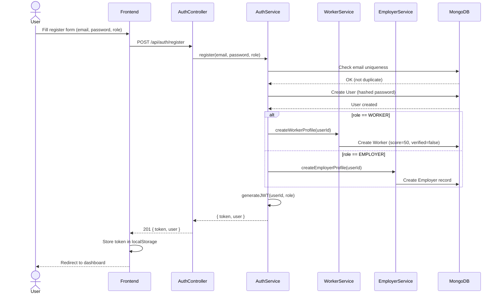
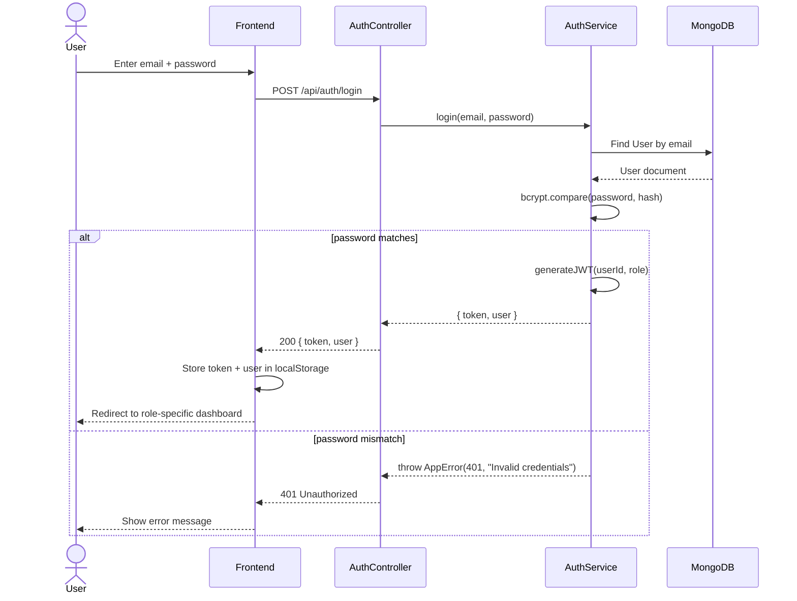
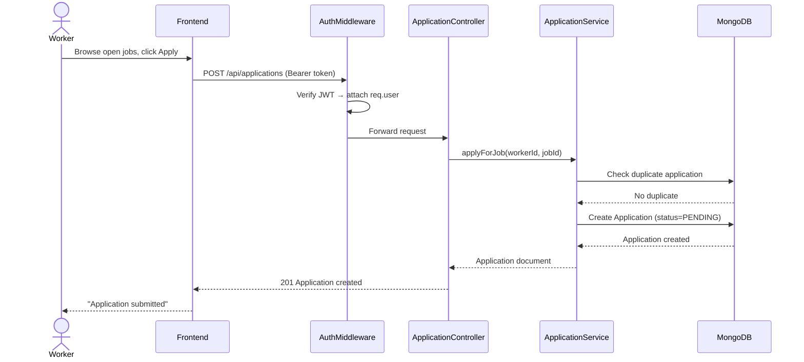
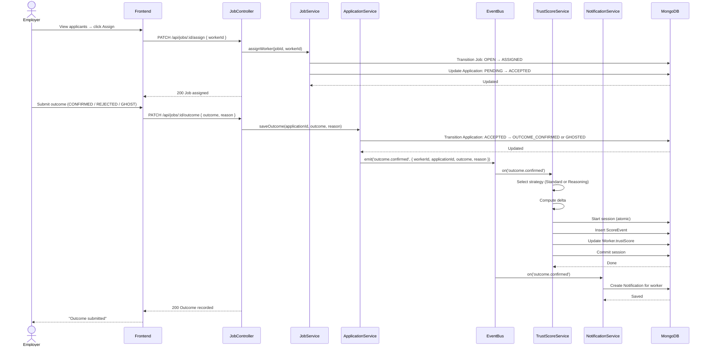
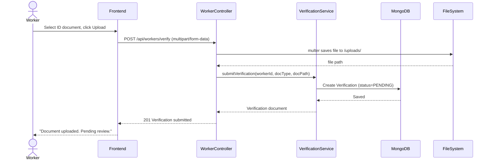
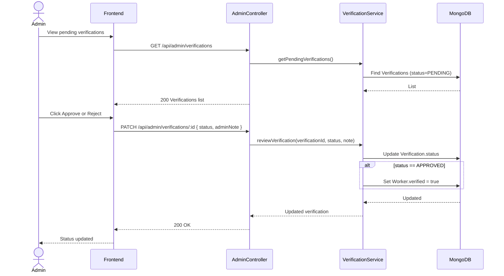
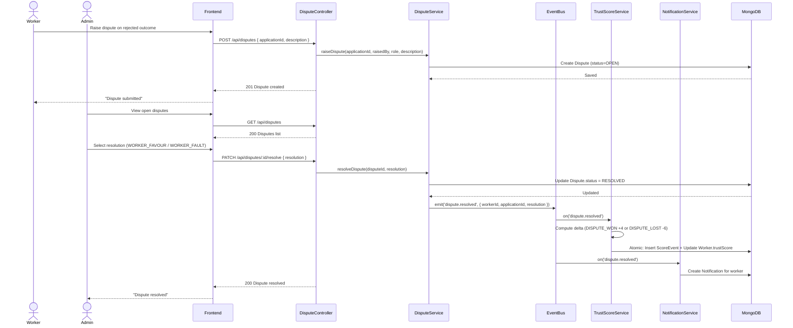
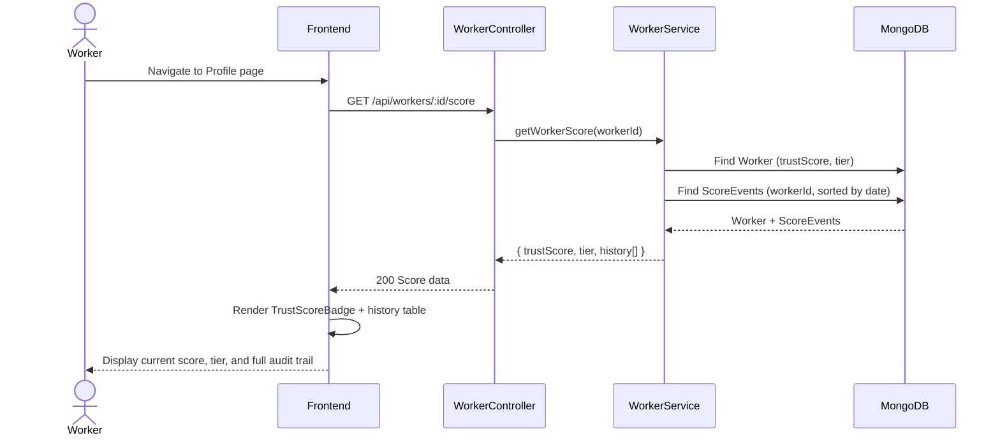

# Sequence Diagrams — Credwork

## 1. User Registration

---

## 2. User Login

---

## 3. Worker Applies for a Job

---

## 4. Employer Assigns Worker and Records Outcome

---

## 5. Worker Uploads Verification Document

---

## 6. Admin Approves / Rejects Verification

---

## 7. Dispute Raised and Resolved

---

## 8. Worker Views Trust Score History

